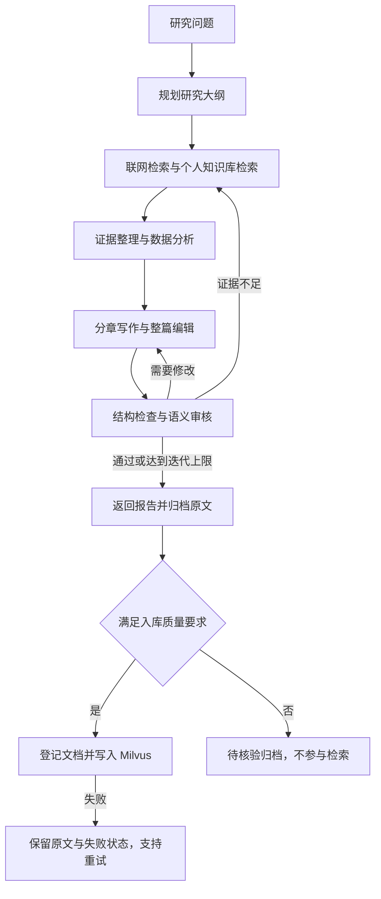

# AI 情报与深度研究助手

面向人工智能技术调研、模型与框架对比、开源项目分析的研究系统。将联网检索、个人知识库、证据整理、报告写作与质量审核连接起来，并把完成的研究报告沉淀为可复用的知识资产。

项目以 **React + FastAPI** 提供交互界面，使用 **LangGraph** 编排研究流程，使用 **Research Harness** 管理运行上下文、模型调用与事件协议，通过 **SSE** 实时展示研究进度。

## 项目定位

主要关注大模型、多模态、AI Agent、RAG、模型训练与推理、算力以及 AI 应用。支持研究以下问题：

- RAG 与微调分别适合哪些场景，如何验证效果？
- 不同模型或智能体框架在同一任务下有什么差异？
- 一个开源 AI 项目的架构、部署条件和使用边界是什么？
- 最近一个月有哪些值得关注的 AI 进展，原始证据在哪里？

人工智能是当前唯一的默认行业入口。银行业务与招投标退出默认研究和采集方向；原有行业数据保留原标签，不会批量改写为 AI 数据。招投标列表旧接口返回 `410`，手动与定时采集不再调用招投标服务。

## 核心功能

| 功能 | 说明 |
|---|---|
| 深度研究 | 规划问题、收集证据、分析、分章写作、整篇编辑、审核与修订 |
| 联网检索 | 通过博查搜索获取资料，保存来源链接和发布时间 |
| 个人知识库 | 上传文档、查看切片、下载原文，按用户范围检索 |
| 基础资料导入 | 一键导入六份 AI 学习资料，解决空知识库的起步问题 |
| 报告自动归档 | 保存报告原文及元数据，通过质量门后写入 RAG |
| 入库重试 | 基础资料与自动归档报告入库失败后，可在页面重试 |
| 研究过程交互 | 后台任务、实时进度、阶段摘要、暂停、恢复与方向调整 |
| 数据分析 | 提取结构化数据，按任务需要生成图表或执行计算分析 |
| AI 资讯 | 默认采集人工智能相关资讯，支持分类查看和手动更新 |

## 研究流程与质量控制



研究角色及职责：

| 角色 | 职责 |
|---|---|
| ChiefArchitect | 理解问题，规划研究结构、查询和待验证假设 |
| DeepScout | 检索资料，整理证据，执行有限的补充搜索 |
| DataAnalyst | 提取数据、实体及关系，生成分析材料 |
| CodeWizard | 根据需要执行计算与代码分析 |
| LeadWriter | 分章写作、整篇编辑与问题修订 |
| CriticMaster | 核验最终正文，判断通过、补充研究或修订 |

报告写作强调直接回答问题、解释依据、说明适用条件和未知项。模型对比要求注明版本和测试条件，区分事实、推断与建议。

质量控制包括：

- 检查报告是否为空、章节是否完整、引用是否对应已知证据、图表数据引用是否有效。
- 按文档 URL 去重统计来源；同一文档中的多条事实不重复充当独立来源。
- 审核实际最终正文，修订后重新进行语义审核。
- 对具有时效要求的问题注入当前日期和检索时间条件，检查资料发布时间。
- 将系统生成的历史报告标记为二手资料，不把它们计为新增独立证据。

**研究结束不等于质量审核通过。** 达到迭代上限仍未解决的问题会影响入库资格。模型评分和结构检查也不能代替对重要结论的人工核验。

## RAG 与报告沉淀

### 基础知识资料

项目附带六份 Markdown 文档，位于 [backend/app/resources/ai_knowledge](backend/app/resources/ai_knowledge/)：

| 文档 | 内容 |
|---|---|
| [Transformer 基础](backend/app/resources/ai_knowledge/01_transformer.md) | 注意力机制、模型介绍的阅读方式与研究边界 |
| [RAG 工作流程](backend/app/resources/ai_knowledge/02_rag.md) | 解析、切片、向量化、检索、生成及失败排查 |
| [Agent 与工作流](backend/app/resources/ai_knowledge/03_agents.md) | 工具调用、执行约束与可靠性评测 |
| [微调与选型](backend/app/resources/ai_knowledge/04_finetuning.md) | 提示词、RAG、微调的适用问题与数据准备 |
| [评测模板](backend/app/resources/ai_knowledge/05_evaluation.md) | 任务定义、评测口径、引用检查与回归记录 |
| [报告规范](backend/app/resources/ai_knowledge/06_report_standard.md) | 报告结构、证据使用、分析表达与历史报告复用 |

这些文档是 AI 辅助编写的学习资料和工程建议，包含资料性质、整理日期与适用边界；方法介绍附有原始论文入口。它们不包含实时模型排名，也不能代替最新资料检索。

登录后进入“知识库”，点击 **导入 AI 基础资料**。文档显示“已完成”后，才可参与 RAG 检索。对同一版本资料重复导入不会重复新增文档。

### 文档处理

- Markdown、UTF-8 文本及部分代码、数据文件直接解析文本、切分并向量化，无需 DocMind。
- PDF、Office 文档和图片通过已有 DocMind 服务解析，需要配置其访问凭据。
- 新知识库使用 UUID 命名向量集合，重命名知识库不改变集合。
- 普通聊天和深度研究使用相同的个人知识库检索范围，仅检索当前用户已完成入库的文档。
- 旧版按知识库名称创建的集合不会自动合并，需要重新上传或导入。

### 自动归档规则

登录用户的深度研究报告按以下顺序保存：

1. 原子写入本地 Markdown 原文及状态清单。
2. 在 PostgreSQL 中登记知识库和文档记录。
3. 符合质量要求的报告切分、向量化并写入 Milvus。

归档保留研究问题、生成时间、会话与研究标识、来源事实、图表数据、质量检查结果和正文哈希。同一用户的相同报告正文使用相同文档 ID；向量使用固定切片 ID 和 upsert 支持重复执行。

报告进入 RAG 需要同时满足：结构质量门通过、语义审核结果为 `PASS`、质量分数至少为 `7`、没有未解决的严重问题，以及在要求时效性时通过对应检查。

| 状态 | 含义 | 参与检索 |
|---|---|---|
| `pending` / `processing` | 等待或正在处理 | 否 |
| `completed` | 文档已完成向量入库 | 是 |
| `failed` | 登记或向量处理失败 | 否 |
| `review_required` | 报告已归档，但未满足质量要求 | 否 |

在“知识库”页面点击 **重试未完成入库**，可重试基础资料和自动归档报告的失败记录。该操作不会绕过待核验报告的质量检查。原文可以独立下载，保存原文与完成向量入库是两个不同状态。

默认归档目录：

```text
data/ai_knowledge/<用户 UUID>/
├── <文档 UUID>.md
└── <文档 UUID>.json
```

可通过 `AI_KNOWLEDGE_DIR` 修改存储目录。部署时需要持久化并备份该目录；仅备份 PostgreSQL 不包含这些原文。未提供用户身份的内部脚本调用不会写入任何人的个人知识库。

## 技术架构

| 层次 | 技术与职责 |
|---|---|
| 前端 | React、TypeScript、Vite、Ant Design、ECharts |
| API | FastAPI、认证、会话、知识库和研究接口 |
| Research Harness | 运行上下文、事件信封、模型调用入口与能力注册 |
| LangGraph | 研究节点、状态传递、分支、修订循环和节点内事件流 |
| PostgreSQL | 用户、会话、文档记录与研究检查点 |
| Redis | 缓存、后台研究状态、命令与事件流 |
| Milvus | 知识库文档向量索引与检索 |
| MinIO / etcd | 当前 Compose 中的 Milvus 配套服务 |
| 本地文件目录 | 文档原文、报告及归档状态清单 |

主流程位于 `backend/app/service/deep_research/`。Harness 提供外层运行能力，LangGraph 负责编排研究；DeepScout 的有限 ReAct 搜索位于研究节点内部。

## 项目结构

```text
industry_information_assistant/
├── backend/
│   ├── app/
│   │   ├── config/                     # 环境与行业配置
│   │   ├── core/                       # 数据库、Redis、认证基础
│   │   ├── harness/                    # 研究运行环境
│   │   │   └── research_runtime/       # 后台任务、状态和事件
│   │   ├── models/                     # 数据模型
│   │   ├── resources/ai_knowledge/     # 六份基础知识资料
│   │   ├── router/                     # API 路由
│   │   ├── service/
│   │   │   ├── deep_research/        # 研究工作流及各角色
│   │   │   ├── ai_knowledge_service.py # 归档、入库、重试与个人检索
│   │   │   └── milvus_service.py       # 向量存储
│   │   ├── tests/                      # 离线自动化测试
│   │   └── app_main.py                 # 后端入口
│   ├── .env.example
│   └── requirements.txt
├── frontend/                           # Web 界面
├── data/ai_knowledge/                   # 运行时原文与报告归档
├── docker/
├── docker-compose.yml                  # 基础服务
├── AI_REFOCUS.md                        # AI 与知识库改造说明
└── README.md
```

## 快速启动

以下命令以 Windows PowerShell 为例。需要 Python 3.10+、Node.js 20+、npm、Docker Desktop 和 Docker Compose。模型、搜索与文档解析服务按所用功能配置。

### 1. 启动基础服务

在项目根目录创建或检查 `.env`，填入自己设置的本地服务凭据：

```ini
POSTGRES_USER=postgres
POSTGRES_PASSWORD=your-local-postgres-password
POSTGRES_DB=industry_assistant
MINIO_ACCESS_KEY=your-local-minio-user
MINIO_SECRET_KEY=your-local-minio-password
TIMEZONE=Asia/Shanghai
```

```powershell
docker compose up -d
docker compose ps
```

根目录 Compose 负责基础服务，前后端需要分别启动。不要同时运行多份占用相同端口的 Compose 配置。

### 2. 配置后端

首次安装且尚无配置文件时，在项目根目录执行：

```powershell
Copy-Item backend/.env.example backend/.env
```

已有 `backend/.env` 时直接编辑，不要覆盖个人配置。模型名称必须填写接入服务实际支持的模型 ID；历史变量名 `DEEPSEEK_*` 不限定只能连接某一家服务。

| 配置 | 用途 |
|---|---|
| `DEEPSEEK_API_KEY` / `DEEPSEEK_BASE_URL` | 核心研究角色的模型服务 |
| `DEEPSEEK_DEFAULT_MODEL` | 核心角色默认模型名 |
| `DEEPSCOUT_API_KEY` / `DEEPSCOUT_BASE_URL` / `DEEPSCOUT_MODEL` | 检索角色的独立模型配置 |
| `DASHSCOPE_API_KEY` / `DASHSCOPE_BASE_URL` | Embedding、重排及相关聊天能力 |
| `BOCHA_API_KEY` | 深度研究联网检索与 AI 资讯采集 |
| `POSTGRES_*` | PostgreSQL 连接，须与根目录配置一致 |
| `REDIS_HOST` / `REDIS_PORT` | 缓存和研究运行时 |
| `MILVUS_HOST` / `MILVUS_PORT` | 向量服务连接 |
| `JWT_SECRET_KEY` | 自行生成的认证签名密钥 |
| `EMBEDDING_MODEL` / `EMBEDDING_DIMENSIONS` | 向量模型与维度，须与索引一致 |
| `AI_KNOWLEDGE_DIR` | 可选的原文与报告归档目录 |
| `DOCMIND_ACCESS_KEY_ID` / `DOCMIND_ACCESS_KEY_SECRET` | PDF、Office、图片解析时使用 |
| `SERPER_API_KEY` | 普通聊天的可选联网搜索能力 |

各研究角色还可通过 `CHIEF_ARCHITECT_MODEL`、`DATA_ANALYST_MODEL`、`CODE_WIZARD_MODEL`、`LEAD_WRITER_MODEL` 和 `CRITIC_MASTER_MODEL` 独立指定模型。

创建环境并启动：

```powershell
conda create -n deepresearch python=3.10 -y
conda activate deepresearch
pip install -r backend/requirements.txt
Set-Location backend
python app/app_main.py
```

已创建环境时跳过创建步骤。默认 API 文档地址：[Swagger UI](http://localhost:8000/docs)。

### 3. 启动前端

另开一个终端，在项目根目录执行；已有前端配置时跳过复制：

```powershell
Copy-Item frontend/.env.example frontend/.env
Set-Location frontend
npm install --legacy-peer-deps
npm run dev
```

本地开发可将 `frontend/.env` 中的 `VITE_API_BASE` 设置为 `http://localhost:8000/`，并将 `VITE_TITLE` 设置为项目名称。

默认访问：[登录页面](http://localhost:5183/login)。端口被占用时，以 Vite 实际输出地址为准。

### 4. 完成首次研究

1. 注册并登录。
2. 在知识库页面导入 AI 基础资料，等待文档状态变为“已完成”。
3. 开启本地知识库检索；研究近期进展时同时开启网络检索。
4. 输入具体问题，例如“比较 RAG 与微调在企业知识问答中的适用条件和评测方法”。
5. 查看研究进度、最终报告与入库提示，再进入知识库确认归档文档。

新浏览器默认开启网络与本地搜索，已有浏览器保留原搜索选择。基础服务启动并不代表模型、搜索和向量 API 均已配置成功，应以实际文档状态和请求结果为准。

## 常用接口

需要认证的接口携带 `Authorization: Bearer <access_token>`。完整参数以运行中的 Swagger 为准。

| 方法与路径 | 用途 |
|---|---|
| `POST /research/start` | 创建后台研究任务 |
| `GET /research/{research_id}/state` | 获取研究状态与归档状态 |
| `GET /research/{research_id}/events` | 订阅 SSE 事件，支持携带游标重连 |
| `POST /research/{research_id}/commands` | 追加约束、暂停、取消等 |
| `POST /research/{research_id}/resume` | 恢复研究任务 |
| `POST /research/stream` | 兼容流式研究入口 |
| `POST /knowledge-bases/bootstrap-ai` | 导入六份基础知识资料 |
| `POST /knowledge-bases/retry-ai` | 重试未完成的自动入库 |
| `POST /knowledge-bases/{kb_id}/documents` | 上传知识库文件 |
| `GET /knowledge-bases/{kb_id}/documents/{doc_id}/chunks` | 查看文档切片 |
| `GET /knowledge-bases/{kb_id}/documents/{doc_id}/download` | 下载原文 |
| `GET /news/list` | 查询 AI 资讯 |
| `POST /news/collect` | 手动采集 AI 资讯 |

研究结束前会发送 `rag_sync` 事件，`research_complete` 也包含同步结果。`completed` 表示入库完成，`failed` 表示需检查后重试，`review_required` 表示仅归档待核验。

## 测试与构建

安装后端依赖后，在项目根目录执行离线测试：

```powershell
Set-Location backend/app
python -m unittest discover -s tests -v
```

测试覆盖研究运行环境、报告质量规则、归档、重试及个人检索等逻辑，使用模拟模型与存储服务。离线测试通过不代表真实服务已完成联调。

前端构建与类型检查分别执行：

```powershell
Set-Location frontend
npm run build
npx tsc --noEmit -p tsconfig.app.json
```

`npm run build` 是打包检查，不替代完整 TypeScript 检查。真实模型研究、文档向量化和联网搜索可能产生服务商调用费用。

## 常见问题

### 导入资料后仍搜不到内容

先确认文档状态为 `completed`，再检查当前登录账号与搜索模式。检查 PostgreSQL、Milvus 和 Embedding 服务是否可用；不要仅凭“原文已保存”判断向量入库成功。

### 报告生成成功，但入库失败

到知识库页面检查文档状态，恢复数据库或向量服务后点击“重试未完成入库”。如果目录不可写，需先修复 `AI_KNOWLEDGE_DIR` 对应目录的写入权限。

### 报告显示“待核验”

这表示报告未满足质量门要求，或仍存在未解决的严重问题。原文保留供检查，但不会参与后续检索。应补充资料或重新研究，普通入库重试不会跳过审核。

### 使用了旧资料回答最新问题

在问题中写明时间范围，并开启网络检索。基础资料与历史报告主要提供背景；时效性检查只能识别部分资料缺口，不能保证搜索服务一定返回足够的新证据。

### 请求返回 401

重新登录并确认请求携带有效访问令牌。网页研究事件流需要认证，不能用不带令牌的请求替代已登录的流式连接。

### 更换向量模型后检索异常

不同模型或维度的向量不能直接混用。保留原文，建立与新模型相容的索引并重新入库。

### Docker 提示缺少 MinIO 或数据库配置

Compose 读取项目根目录 `.env`，后端使用 `backend/.env`。检查文件位置，并保证数据库账号、密码和库名一致。

## 配置与部署注意事项

- README 中的凭据均为占位符，实际值放在本地环境配置中。
- 分享项目前检查配置模板及文档，移除真实 API Key、密码和访问令牌；若真实凭据已经暴露，应到对应服务商轮换。
- 持久化数据库、Milvus 配套存储以及 `data/ai_knowledge/`，并限制生产环境的服务端口与 CORS 来源。
- 当前后台研究执行器运行在应用进程内，Redis 保存状态与事件；进程重启后需要通过恢复入口继续任务，不等同于独立任务队列自动接管。
- 整篇编辑和修订复审会增加模型调用。报告质量、响应时间与费用需要结合真实任务持续评估。

更多改造背景与验收步骤见 [AI_REFOCUS.md](AI_REFOCUS.md)。
