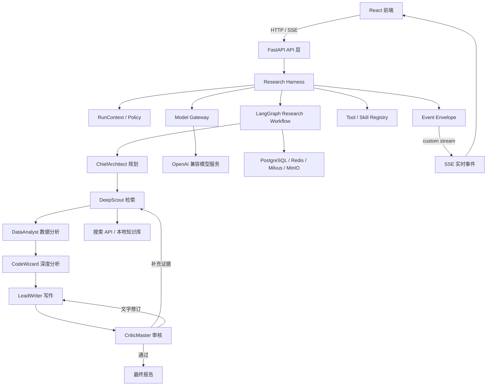

# 行业信息助手（Industry Information Assistant）

面向行业研究、技术调研和企业信息分析的 AI 深度研究系统。项目使用 **Harness 统一管理智能体运行环境**，使用 **LangGraph 编排研究流程**，并通过 **SSE 实时展示节点内部的搜索、分析、写作和审核进度**。

> 当前主研究流程位于 `backend/app/service/deep_research_v2`。Harness 是外层运行时，不是第二套工作流框架；LangGraph 仍是唯一的研究流程编排器。

## 核心能力

- 多智能体深度研究：规划、搜索、数据分析、代码分析、报告写作和质量审核。
- LangGraph 工作流：支持条件路由、补充检索、修订循环和节点状态传递。
- 节点内部实时输出：使用 LangGraph `custom stream` 将长节点中的阶段、搜索结果和进度持续输出到 SSE。
- Agent Harness：统一运行上下文、事件协议、模型调用、Skills、Tools 和质量门。
- 时效性研究：识别“最新、近期、当前、前沿”等表达，自动注入当前日期、近期搜索条件并检查来源发布时间。
- 证据与引用：保存搜索来源、发布时间、结构化事实和报告引用。
- 知识库与 RAG：支持文档上传、向量检索、知识库管理和长期记忆。
- 数据分析与可视化：支持结构化数据分析、图表生成和前端展示。
- 行业信息：包含行业新闻、招投标、股票和政策检索等扩展模块。
- 任务恢复：研究状态可保存至检查点，支持查询和恢复。

## 总体架构



### Harness 与 LangGraph 的职责

| 层 | 主要职责 |
|---|---|
| Harness | 创建运行上下文、生成 `run_id`、统一模型入口、注册 Skill/Tool、包装事件、执行质量门 |
| LangGraph | 定义节点顺序、分支、循环、共享状态和节点内部 `custom stream` |
| Agent | 执行某个研究角色的具体业务逻辑 |
| Skill | 可复用、可独立测试的能力，例如最新资料检索 |
| SSE | 将适合展示的实时事件推送给前端，不传输模型隐藏推理过程 |

每条 Harness 事件会在兼容原有字段的基础上增加：

```json
{
  "type": "search_progress",
  "run_id": "run_xxx",
  "session_id": "session_xxx",
  "sequence": 12,
  "timestamp": "2026-09-01T10:30:00+00:00",
  "content": "正在检索最新资料"
}
```

## 技术栈

| 模块 | 技术 |
|---|---|
| 前端 | React 19、TypeScript、Vite、Ant Design、ECharts |
| 后端 | Python 3.10+、FastAPI、Uvicorn |
| 智能体编排 | LangGraph 1.2+ |
| 模型接口 | OpenAI-compatible API、DashScope/百炼等 |
| 搜索 | 博查 Web Search，可扩展其他搜索工具 |
| 数据库 | PostgreSQL、Redis |
| 向量检索 | Milvus |
| 对象存储 | MinIO |
| 全文检索 | Elasticsearch（可选） |

## 项目结构

```text
industry_information_assistant/
├─ backend/
│  ├─ app/
│  │  ├─ harness/                    # Agent Harness 运行时
│  │  │  ├─ context.py               # RunContext 与时效策略
│  │  │  ├─ events.py                # 统一事件信封
│  │  │  ├─ model_gateway.py         # 模型调用入口
│  │  │  ├─ registry.py              # Tool / Skill 注册表
│  │  │  ├─ evaluator.py             # 确定性质量门
│  │  │  └─ skills/                   # 可复用 Skills
│  │  ├─ service/deep_research_v2/
│  │  │  ├─ graph.py                  # LangGraph 工作流
│  │  │  ├─ state.py                  # Graph 全局状态
│  │  │  ├─ service.py                # 研究服务与 SSE 出口
│  │  │  └─ agents/                   # 六个研究 Agent
│  │  ├─ router/                      # FastAPI 路由
│  │  ├─ models/                      # 数据模型
│  │  ├─ core/                        # 数据库、安全、Redis
│  │  ├─ config/                      # 统一配置
│  │  └─ app_main.py                  # 后端入口
│  ├─ requirements.txt
│  └─ .env.example
├─ frontend/
│  ├─ src/
│  ├─ package.json
│  └─ .env.example
├─ docker/
├─ docker-compose.yml
└─ README.md
```

## 环境要求

- Docker Desktop / Docker Compose
- Conda 或 Python 3.10+
- Node.js 18+（建议 Node.js 20+）
- npm
- 可用的模型 API Key
- 博查搜索 API Key（使用联网研究时需要）

## 快速启动

以下命令默认在项目根目录执行。

### 1. 获取代码

```powershell
git clone <your-repository-url>
cd industry_information_assistant
```

### 2. 配置 Docker 基础服务

根目录的 `.env` 由 `docker-compose.yml` 读取，至少需要：

```ini
POSTGRES_USER=postgres
POSTGRES_PASSWORD=请设置一个本地数据库密码
POSTGRES_DB=industry_assistant

MINIO_ACCESS_KEY=minioadmin
MINIO_SECRET_KEY=请设置一个本地MinIO密码

TIMEZONE=Asia/Shanghai
```

`MINIO_ACCESS_KEY` 和 `MINIO_SECRET_KEY` 是你为本地 MinIO 自己设置的管理员凭据，不需要到网站注册获取。生产环境不要使用示例值。

启动基础服务：

```powershell
docker compose up -d
docker compose ps
```

默认服务地址：

| 服务 | 地址 |
|---|---|
| PostgreSQL | `localhost:5432` |
| Redis | `localhost:6379` |
| Milvus | `localhost:19530` |
| Milvus 健康检查 | `localhost:9091` |
| MinIO API | `localhost:9000` |
| MinIO Console | `http://localhost:9001` |
| Elasticsearch | `http://localhost:1200` |

### 3. 配置并启动后端

复制配置模板：

```powershell
Copy-Item backend/.env.example backend/.env
```

编辑 `backend/.env`，至少配置以下项目：

```ini
# 核心 Agent 使用的 OpenAI-compatible 服务
DEEPSEEK_API_KEY=your-api-key
DEEPSEEK_BASE_URL=https://your-provider.example.com/compatible-mode/v1

# DeepScout 可以使用独立模型服务；不配置时按项目设置回退
DEEPSCOUT_API_KEY=your-api-key
DEEPSCOUT_BASE_URL=https://your-provider.example.com/compatible-mode/v1
DEEPSCOUT_MODEL=your-model-name

# Embedding、Rerank、通用聊天等能力
DASHSCOPE_API_KEY=your-dashscope-api-key
DASHSCOPE_BASE_URL=https://dashscope.aliyuncs.com/compatible-mode/v1

# 联网搜索
BOCHA_API_KEY=your-bocha-api-key

# 必须与根目录 Docker .env 保持一致
POSTGRES_HOST=localhost
POSTGRES_PORT=5432
POSTGRES_USER=postgres
POSTGRES_PASSWORD=your-postgres-password
POSTGRES_DB=industry_assistant

REDIS_HOST=localhost
REDIS_PORT=6379
MILVUS_HOST=localhost
MILVUS_PORT=19530

# 自己生成的随机字符串
JWT_SECRET_KEY=your-random-jwt-secret
```

创建并进入 Conda 环境：

```powershell
conda create -n deepresearch python=3.10 -y
conda activate deepresearch
pip install -r backend/requirements.txt
python backend/app/app_main.py
```

后端启动后访问：

- API：`http://localhost:8000`
- Swagger 文档：`http://localhost:8000/docs`

### 4. 配置并启动前端

另开一个终端：

```powershell
Copy-Item frontend/.env.example frontend/.env
Set-Location frontend
npm install --legacy-peer-deps
npm run dev
```

浏览器访问：`http://localhost:5183/login`

## 模型配置

不同 Agent 可以独立配置模型。具体可用模型名取决于你所使用的模型服务商，不要直接假设某个模型名一定存在。

| 环境变量 | Agent |
|---|---|
| `CHIEF_ARCHITECT_MODEL` | ChiefArchitect：规划研究大纲 |
| `DEEPSCOUT_MODEL` | DeepScout：网页和知识库检索 |
| `DATA_ANALYST_MODEL` | DataAnalyst：结构化数据分析 |
| `CODE_WIZARD_MODEL` | CodeWizard：计算与深度分析 |
| `LEAD_WRITER_MODEL` | LeadWriter：报告写作与修订 |
| `CRITIC_MASTER_MODEL` | CriticMaster：质量审核与补充研究决策 |

模型调用已统一收口到 Harness `ModelGateway`。以后增加重试、降级、限流、Token 统计或多模型路由时，不需要分别修改六个 Agent。

## 深度研究流程

```text
Plan
  → Research
  → Data Analyze
  → Analyze
  → Write
  → Review
       ├─ 证据不足 → Re-Research → Rewrite → Review
       ├─ 文字问题 → Revise → Review
       └─ 通过 → Complete
```

长节点调用 `Agent.add_message()` 时，Graph 注入的 `StreamWriter` 会立即发送 LangGraph `custom` 事件。因此不需要等待整个搜索或写作节点完成，前端就能持续看到进度；节点完成后的状态变更则通过 `updates` stream 处理。

## “最新资料”处理机制

当问题包含“最新、最近、近期、当前、目前、今年、前沿”等时效表达时：

1. Harness 根据问题生成时效策略。
2. `fresh_research` Skill 将当前日期写入规划上下文。
3. 规划器生成包含当前年份的搜索词。
4. DeepScout 使用近期搜索过滤，并将时效条件加入缓存键。
5. 搜索结果保存 `published_at` 等来源日期。
6. Graph 完成后执行时效性质量门。
7. 如果近期来源数量不足，SSE 输出 `quality_warning`，避免把旧资料静默包装成“最新报告”。

## 主要 API

完整接口以启动后的 Swagger 文档为准。

| 路径前缀 | 功能 |
|---|---|
| `/auth` | 注册、登录和认证 |
| `/sessions` | 会话管理 |
| `/research` | 深度研究、取消、检查点和恢复 |
| `/chat` | 普通聊天 |
| `/knowledge-bases` | 知识库管理 |
| `/documents` | 文档上传与处理 |
| `/memories` | 长期记忆 |
| `/search` | 搜索能力 |
| `/database` | 数据库探索与 Text2SQL |
| `/news` | 行业新闻和招投标信息 |

## 测试

Harness 的本地测试不调用真实模型或搜索 API：

```powershell
Set-Location backend/app
python -m unittest tests.test_harness -v
```

运行 Deep Research 端到端测试会调用真实模型和搜索服务，可能产生费用：

```powershell
Set-Location backend/app
python -m scripts.test_deep_research_v2
```

## 常见问题

### Docker 提示 `MINIO_ACCESS_KEY is missing`

Docker Compose 读取的是项目根目录 `.env`，不是 `backend/.env`。在根目录 `.env` 中设置：

```ini
MINIO_ACCESS_KEY=minioadmin
MINIO_SECRET_KEY=your-local-minio-password
POSTGRES_PASSWORD=your-local-postgres-password
```

然后重新执行：

```powershell
docker compose up -d
```

### `POST /sessions` 返回 `401 Unauthorized`

这表示后端已经正常响应，但请求没有携带有效身份信息。先通过 `/auth` 登录，再让前端请求携带返回的访问令牌。清理浏览器中失效的旧令牌后重新登录，也可以解决常见的本地调试问题。

### 模型 API 返回 `400 Arrearage`

这是模型服务商账户欠费、余额不足或账号状态异常，不是 LangGraph 错误。请在对应服务商控制台检查账户状态、API Key 和模型权限，处理后重启后端。

### 报告只引用旧资料

确认问题中包含明确的时效要求，例如“截至当前”“最近一年”或“最新”。新版 Harness 会自动加入当前年份和近期搜索过滤，并在近期来源不足时发送 `quality_warning`。

### 修改了模型名后调用失败

模型名称必须是当前 API 服务商实际开放的模型 ID。模型名看起来合理并不代表接口一定支持；请以服务商控制台或官方模型列表为准。

### 前端安装依赖失败

```powershell
Set-Location frontend
npm install --legacy-peer-deps
```

如需清理依赖，请确认当前目录确实是 `frontend` 后再删除 `node_modules`，避免误操作其他目录。

## 安全说明

- 不要提交根目录 `.env`、`backend/.env` 或 `frontend/.env`。
- `.env.example` 只能包含占位符，不能包含真实 API Key、数据库密码或 JWT 密钥。
- 如果密钥曾经推送到 GitHub，仅从最新提交删除是不够的：应立即在服务商控制台吊销并重新生成密钥，再根据需要清理 Git 历史。
- 生产环境必须更换 PostgreSQL、MinIO 和 JWT 示例凭据，并限制 CORS 来源。
- SSE 只应输出用户可见的研究进度、工具摘要和引用，不应输出模型隐藏推理过程或敏感配置。

## 当前重构状态

已经完成：

- LangGraph 成为唯一研究工作流执行器。
- 使用 `custom stream` 实现长节点内部 SSE 实时输出。
- 增加外层 Research Harness。
- 模型调用统一进入 Model Gateway。
- 增加 RunContext、统一事件信封、Skill/Tool 注册表。
- 增加最新资料 Skill 和时效性质量门。
- 删除旧的 asyncio Queue 手写工作流。

后续适合继续完善：

- Model Gateway 的自动重试、限流、熔断和模型降级。
- Tool Registry 的权限策略、调用预算和审计日志。
- 更多可复用 Skills 及 Skill 级测试。
- 来源权威性、引用一致性和事实冲突质量门。
- 完整的 Token、费用、延迟和成功率观测。

## License

当前仓库未提供独立 License 文件。公开分发或允许第三方使用前，请根据项目需求补充合适的开源许可证。
